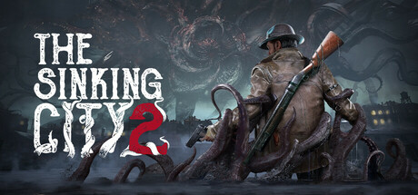
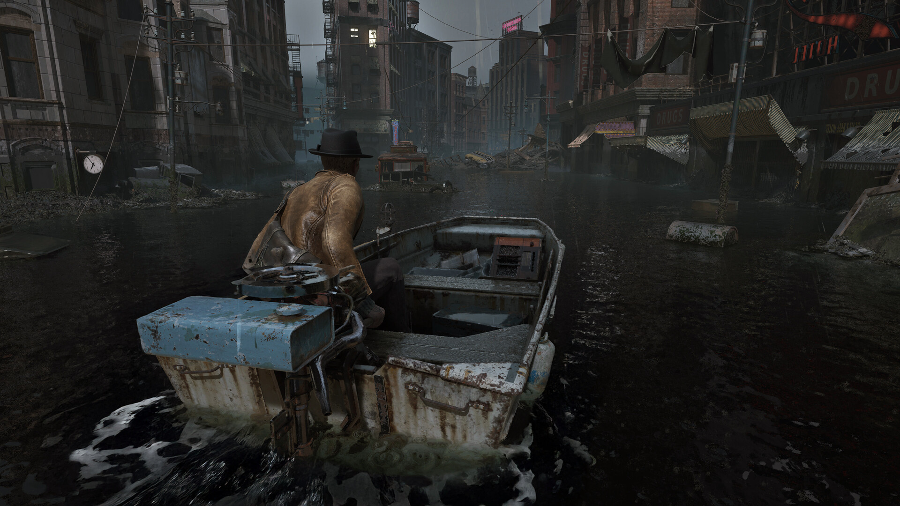

# The Sinking City 2 Survival Practice Tools

The Sinking City 2 survival tools for PC with supply controls, inventory values, damage settings and exploration profiles. Manage the pressure of limited resources while investigating flooded Arkham.

---

## Download

---

## Game Gallery

 

## Features

| Feature | What it does |
|---|---|
| **Supply consumption** | Adjust ammunition and healing-item consumption. |
| **Inventory values** | Set item quantities for the survival loadout you want to use. |
| **Damage settings** | Control incoming damage during combat and encounter practice. |
| **Exploration profiles** | Organize saved progress by location and return to earlier checkpoints. |
| **Puzzle reference** | Keep location notes and reveal puzzle hints separately from story details. |
| **Survival presets** | Save different resource and combat settings for exploration and practice. |

## Profiles

Prepare an exploration profile with your preferred supply and damage settings. Keep location notes beside the profile and switch configurations when you return to combat.

## Getting Started

1. Open the **Download** link above.
2. Download the PC package and follow the included setup instructions.
3. Launch The Sinking City 2 and open the application.
4. Select the game profile and the options you want to use.
5. Save your configuration for the next session.

## Project Information

| Item | Details |
|---|---|
| Game | The Sinking City 2 |
| Platform | Windows / PC |
| Focus | Inventory / Supplies / Damage / Exploration / Puzzle notes |
| Download | [PC package](https://flyn.im/6PCpxq) |

## FAQ

<strong>What does this toolkit include?</strong>

Supply consumption, Inventory values, Damage settings, Exploration profiles, Puzzle reference, Survival presets.

<strong>Where can I download the application?</strong>

Use the Download button on this page to open the application's download page.

## Quick Download

---

Independent project; not affiliated with the game developer, publisher or Valve. Gallery images depict the game. See [image credits](assets/CREDITS.md), [sources](SOURCES.md) and the [license](LICENSE).
                                                                                                    